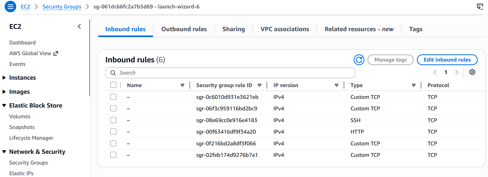
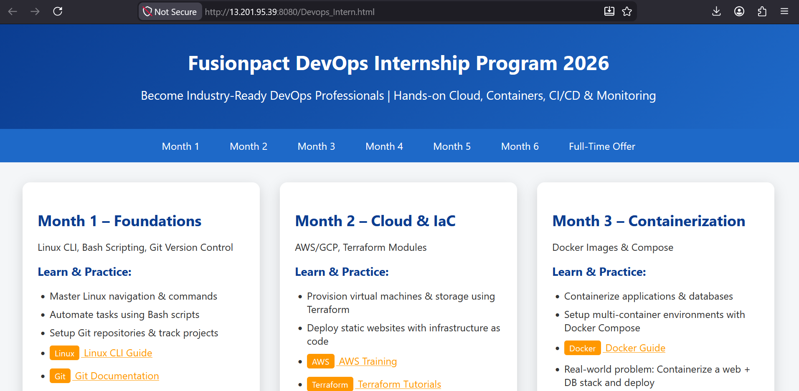
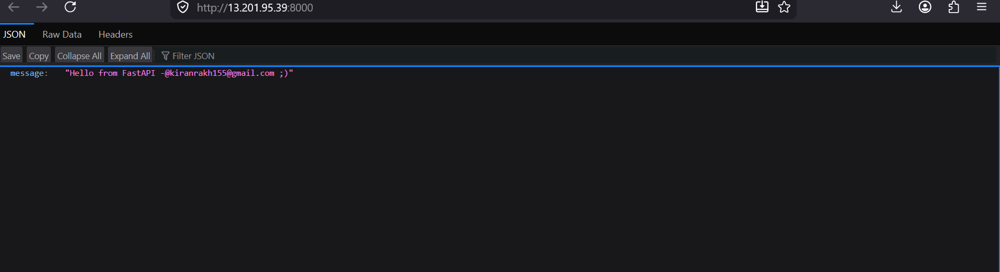
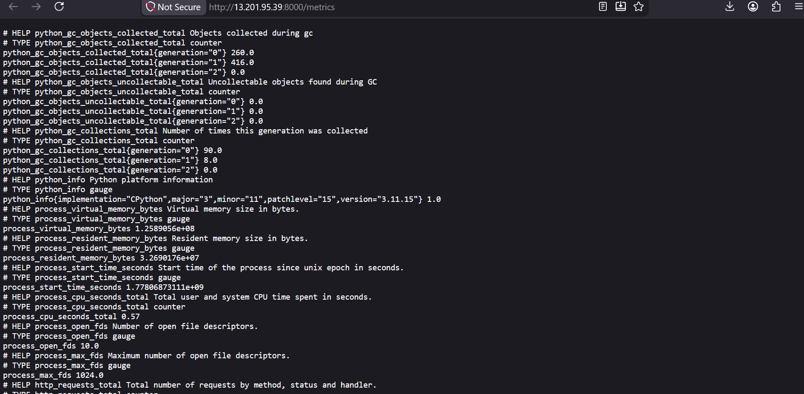
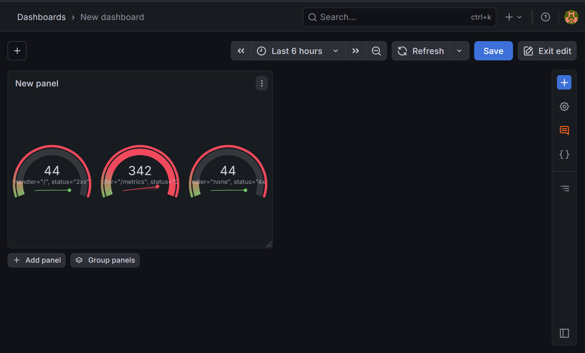
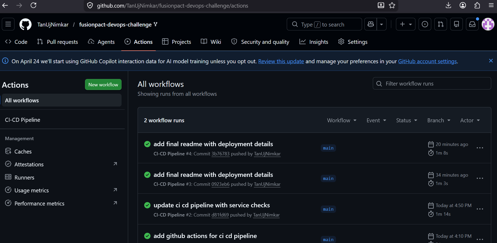

# 🔥 Fusionpact DevOps Challenge — Complete Solution

**Status:** ✅ Deployed on AWS | ✅ Monitoring Active | ✅ CI/CD Working  
**Candidate:** Tanuj Nimkar  

---

# 🌐 Live AWS Deployment

| Service | URL |
|----------|------|
| Frontend | http://13.201.95.39:8080/Devops_Intern.html |
| Backend API | http://13.201.95.39:8000 |
| Metrics Endpoint | http://13.201.95.39:8000/metrics |
| Prometheus | http://13.201.95.39:9090 |
| Grafana Dashboard | http://13.201.95.39:3000 |

---

# ☁️ AWS Security Group Configuration

The EC2 instance security group was configured with all required ports for:
- frontend access
- backend API
- monitoring stack
- SSH access



---

# 🖥️ Frontend Application Running on AWS

The frontend was successfully deployed publicly on AWS EC2 using Nginx.



---

# ⚡ Backend API Verification

FastAPI backend successfully running and accessible publicly.



---

# 📊 Prometheus Metrics Endpoint

Prometheus metrics exposed correctly through `/metrics`.

The backend exports:
- request counts
- CPU metrics
- memory usage
- latency statistics



---

# 📈 Grafana Monitoring Dashboard

Grafana dashboards were configured to visualize:
- HTTP request metrics
- request distribution
- monitoring health
- backend activity



---

# 🔁 GitHub Actions CI/CD Pipeline

GitHub Actions pipeline automatically performs:

✅ Docker image builds  
✅ Backend health checks  
✅ Frontend availability checks  
✅ Metrics endpoint checks  
✅ Prometheus checks  
✅ Grafana checks  

Successful pipeline execution:



---

# 🐳 Dockerized Architecture

This project uses Docker Compose to orchestrate:

| Container | Purpose |
|------------|----------|
| frontend | Nginx static frontend |
| backend | FastAPI backend |
| prometheus | Metrics collection |
| grafana | Monitoring dashboard |

---

# 📦 Docker Compose Setup

```yaml
services:
  backend:
    build: ./backend
    ports:
      - "8000:8000"

  frontend:
    build: ./frontend
    ports:
      - "8080:80"

  prometheus:
    image: prom/prometheus
    ports:
      - "9090:9090"

  grafana:
    image: grafana/grafana
    ports:
      - "3000:3000"
```

---

# 💾 Data Persistence Verification

Docker named volume `backend_data` was used to persist backend data.

### Verification Commands

```bash
docker exec -it fusionpact-devops-challenge-backend-1 sh

cd app/data

echo "hello devops" > test.txt

docker compose down

docker compose up -d
```

After restarting containers, `test.txt` still existed, confirming persistent storage works correctly.

---

# 🛠 Technologies Used

| Technology | Purpose |
|------------|---------|
| Docker | Containerization |
| Docker Compose | Multi-container orchestration |
| FastAPI | Backend API |
| Nginx | Frontend hosting |
| Prometheus | Metrics collection |
| Grafana | Monitoring dashboards |
| GitHub Actions | CI/CD automation |
| AWS EC2 | Cloud deployment |

---

# ⚠️ Challenges Faced

### FastAPI Import Path Issue
Initially used:
```bash
uvicorn main:app
```

Corrected to:
```bash
uvicorn app.main:app
```

---

### YAML Indentation Errors
Docker Compose failed due to incorrect YAML indentation under `volumes:`.

---

### Docker PATH Issue (Windows)
Docker commands were not recognized until system restart.

---

### SSH Permission Problem
Fixed Windows `.pem` permission issue using:

```bash
icacls fusionpact-devops-vm.pem /inheritance:r /grant:r "%USERNAME%:R"
```

---

### Grafana Empty Panels
Generated backend traffic manually by refreshing `/metrics` endpoint.

---

# ✅ Requirements Checklist

| Requirement | Status |
|-------------|--------|
| Dockerized Frontend | ✅ |
| Dockerized Backend | ✅ |
| Docker Compose Setup | ✅ |
| Persistent Storage | ✅ |
| AWS Cloud Deployment | ✅ |
| Public Accessibility | ✅ |
| Prometheus Monitoring | ✅ |
| Grafana Dashboard | ✅ |
| CI/CD Automation | ✅ |
| SOP Documentation | ✅ |

---

# 🌍 Public URLs

### Frontend
http://13.201.95.39:8080/Devops_Intern.html

### Backend API
http://13.201.95.39:8000

### Metrics
http://13.201.95.39:8000/metrics

### Prometheus
http://13.201.95.39:9090

### Grafana
http://13.201.95.39:3000

---

# 📧 Submission Info

**Repository:**  
https://github.com/TanUjNimkar/fusionpact-devops-challenge

**SOP Document:**  
Attached separately as PDF in email submission

**Submission Contact:**  
vaishali.yadav@fusionpact.com

---

# 📁 Repository

🔗 https://github.com/TanUjNimkar/fusionpact-devops-challenge

---

# ✅ Build Information

| Property | Value |
|----------|-------|
| Candidate | Tanuj Nimkar |
| Deployment Date | May 6, 2026 |
| Cloud Provider | AWS EC2 |
| Region | Mumbai (ap-south-1) |
